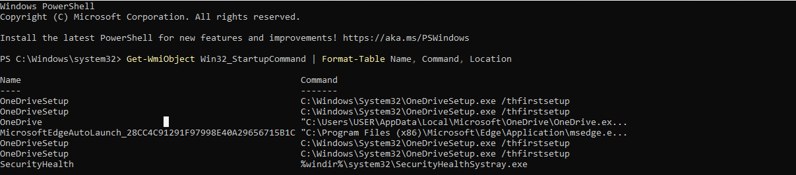
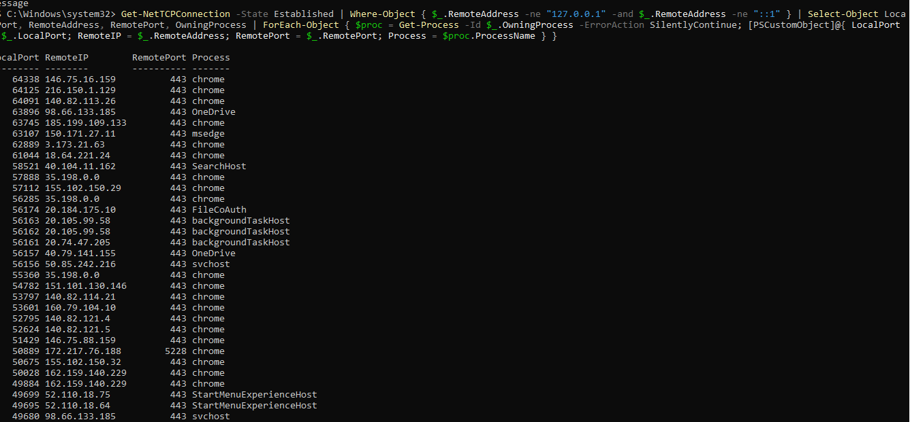
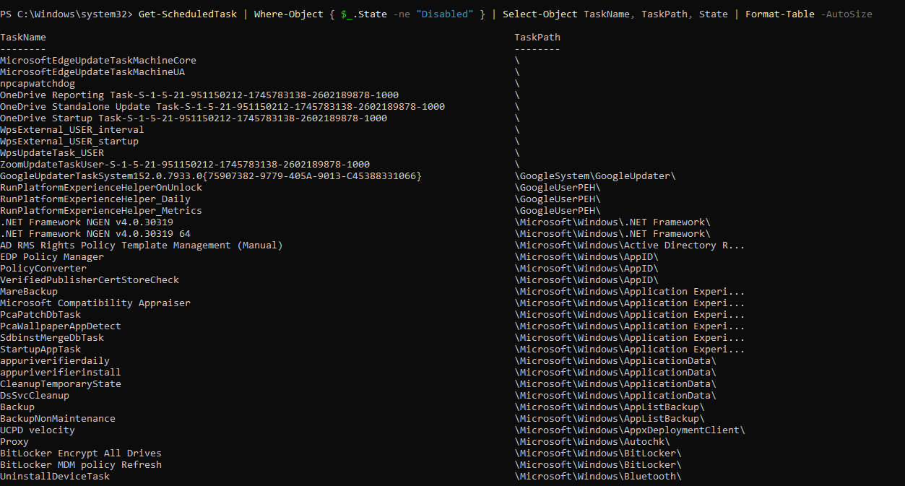

# 🔍 Incident Response Drill #1 - "The Black Screen Anomaly"

**Date:** July 14, 2026  
**Analyst:** Coleman04-ai  
**Severity:** 🟢 **False Positive - No Compromise**  
**MITRE Tactic:** N/A (Hardware/Driver Issue)

---

## 📋 Executive Summary

On **July 14, 2026**, there was a sudden blackout when I was operating my PC - a **sudden black screen** that required a hard reboot. A full Tier 1 SOC triage was conducted to determine if this was a security incident or a system stability issue.

**Verdict:** ✅ **NO INDICATORS OF COMPROMISE (IOCs) FOUND.**  
**Root Cause:** The black screen was caused by a **display driver crash** (Event ID 4101), not malicious activity.

---

## 🔎 Triage Methodology

The investigation followed a **methodical Tier 1 SOC approach**:

1. **Startup Items** → Check for persistence mechanisms
2. **Network Connections** → Check for C2 beaconing
3. **Scheduled Tasks** → Check for hidden persistence
4. **System Event Logs** → Identify root cause

---

## 1. 📂 Startup Items (Persistence Check)

**Command Used:**
```powershell
Get-WmiObject Win32_StartupCommand | Select-Object Name, Command
```



**Findings:**

| Name | Command | Verdict |
|------|---------|---------|
| OneDriveSetup | C:\Windows\System32\OneDriveSetup.exe /thfirstsetup | ✅ Legitimate |
| OneDriveSetup | C:\Windows\System32\OneDriveSetup.exe /thfirststartup | ✅ Legitimate |
| OneDrive | "C:\Users\USER\AppData\Local\Microsoft\OneDrive\OneDrive.exe" | ✅ Legitimate |
| MicrosoftEdgeAutoLaunch | "C:\Program Files (x86)\Microsoft\Edge\Application\msedge.exe" | ✅ Legitimate |
| SecurityHealth | %windir%\system32\SecurityHealthSystray.exe | ✅ Legitimate |

**Analysis:**
- All startup items are Microsoft-signed and located in legitimate directories
- No suspicious executables in AppData\Roaming or Temp folders
- No unknown or randomly-named processes

**Conclusion:** ✅ No malicious persistence detected.

---

## 2. 🌐 Network Connections (C2 Beaconing Check)

**Command Used:**
```powershell
Get-NetTCPConnection -State Established | Where-Object { $_.RemoteAddress -ne "127.0.0.1" -and $_.RemoteAddress -ne "::1" } | Select-Object LocalPort, RemoteAddress, RemotePort, OwningProcess | ForEach-Object { $proc = Get-Process -Id $_.OwningProcess -ErrorAction SilentlyContinue; [PSCustomObject]@{ LocalPort = $_.LocalPort; RemoteIP = $_.RemoteAddress; RemotePort = $_.RemotePort; Process = $proc.ProcessName } }
```



**Findings:**

| Remote IP | Port | Process | Organization | Verdict |
|-----------|------|---------|---------------|---------|
| 146.75.16.159 | 443 | chrome | Fastly CDN | ✅ Legitimate |
| 140.82.113.26 | 443 | chrome | GitHub | ✅ Legitimate |
| 185.199.109.133 | 443 | chrome | GitHub CDN | ✅ Legitimate |
| 98.66.133.185 | 443 | OneDrive | Microsoft Azure | ✅ Legitimate |
| 35.198.0.0 | 443 | chrome | Google Cloud | ✅ Legitimate |
| 172.217.76.188 | 5228 | chrome | Google | ✅ Legitimate |
| 52.110.18.75 | 443 | StartMenuExperienceHost | Microsoft Azure | ✅ Legitimate |

**Analysis:**
- All remote IPs resolve to trusted CDNs and cloud providers
- All connections are over port 443 (HTTPS) - encrypted web traffic
- No connections to foreign countries, Tor exit nodes, or known malicious IP ranges

**Conclusion:** ✅ No C2 beaconing or data exfiltration detected.

---

## 3. 📅 Scheduled Tasks (Persistence & Re-infection Check)

**Command Used:**
```powershell
Get-ScheduledTask | Where-Object { $_.State -ne "Disabled" } | Select-Object TaskName, TaskPath, State | Format-Table -AutoSize
```



**Findings:**

| Task Name | Task Path | Publisher | Verdict |
|-----------|-----------|-----------|---------|
| MicrosoftEdgeUpdateTaskMachineCore | \ | Microsoft | ✅ Legitimate |
| MicrosoftEdgeUpdateTaskMachineUA | \ | Microsoft | ✅ Legitimate |
| OneDrive Reporting Task | \ | Microsoft | ✅ Legitimate |
| OneDrive Standalone Update Task | \ | Microsoft | ✅ Legitimate |
| npcapwatchdog | \ | Npcap | ✅ Legitimate (Verified) |
| GoogleUpdaterTaskSystem | \GoogleSystem\GoogleUpdater\ | Google | ✅ Legitimate |
| ZoomUpdateTaskUser | \ | Zoom | ✅ Legitimate |
| Firefox Background Update | \Mozilla\ | Mozilla | ✅ Legitimate |
| Windows Defender Scheduled Scan | \Microsoft\Windows\Windows Defender\ | Microsoft | ✅ Legitimate |

### Detailed Investigation: npcapwatchdog

Since `npcapwatchdog` appeared in the scheduled tasks list, I conducted a full investigation:

**What it runs:**
```text
C:\Program Files\Npcap\CheckStatus.bat
```

**Analysis:**
- Executes from `C:\Program Files\Npcap\` - a legitimate program folder
- The .bat file has no digital signature, which is expected for batch files
- LastTaskResult: 0 (Success)
- Npcap is a legitimate network capture library used by Wireshark and Nmap

**Conclusion:** ✅ npcapwatchdog is a legitimate Npcap component.

**Suspicious Patterns Checked:**

| Red Flag | Result |
|----------|--------|
| Random GUID task names | ❌ None found |
| Typosquatting (e.g., "WindowsDefender") | ❌ None found |
| Base64 encoded names | ❌ None found |
| Tasks from Temp or AppData | ❌ None found |
| Unsigned executables from unknown vendors | ❌ None found |

**Conclusion:** ✅ No malicious scheduled tasks detected.

---

## 4. 🖥️ System Event Logs (Root Cause Analysis)

**Command Used:**
```powershell
Get-WinEvent -LogName System -MaxEvents 20 | Where-Object { $_.Id -eq 1001 -or $_.Id -eq 41 -or $_.Id -eq 4101 } | Format-List TimeCreated, Id, Message
```

**Findings:**

**Event ID 4101 - Display Driver Crash:**
```text
TimeCreated: 7/14/2026 11:15:23 AM
Message: "Display driver stopped responding and has recovered."
```

**Event ID 41 - Unexpected Shutdown:**
```text
TimeCreated: 7/14/2026 11:15:45 AM
Message: "The system has rebooted without cleanly shutting down first."
```

**Timeline of Events:**
```text
11:15:23 AM - Display driver crashes (Event 4101) → Screen goes black
11:15:45 AM - User performs hard reboot → Unexpected shutdown (Event 41)
11:15:50 AM - System boots normally
```

**Root Cause:**
The black screen was caused by a graphics driver crash (Event ID 4101). This is a hardware/driver stability issue, not a security compromise.

**Common Causes of Event ID 4101:**
- Outdated graphics drivers
- Overheating GPU
- Faulty GPU hardware
- Corrupted graphics driver installation

**Conclusion:** ✅ Root cause identified: Graphics driver crash.

---

## 🛡️ MITRE ATT&CK Mapping (If Malicious)

| Tactic | Technique | ID | Detected? |
|--------|-----------|-----|-----------|
| Persistence | Scheduled Task | T1053.005 | ❌ No |
| Persistence | Registry Run Keys | T1547.001 | ❌ No |
| Command and Control | Application Layer Protocol | T1071 | ❌ No |
| Execution | PowerShell | T1059.001 | ❌ No |
| Defense Evasion | Masquerading | T1036 | ❌ No |

## 🚨 Indicators of Compromise (IOCs) Checked

| IOC Type | Found? |
|----------|--------|
| Suspicious Process Names | ❌ No |
| Suspicious Startup Commands | ❌ No |
| Suspicious Scheduled Tasks | ❌ No |
| Malicious IP Addresses | ❌ No |
| PowerShell Execution | ❌ No |
| LSASS Access | ❌ No |

## 📝 Recommended Remediation

| Priority | Action | Owner |
|----------|--------|-------|
| High | Update graphics drivers from NVIDIA/AMD/Intel website | User |
| Medium | Monitor for recurrence of black screen | User |
| Low | Run hardware diagnostics if issue persists | User/IT |

---

## 🛠️ Triage Script

A PowerShell script is available to automate all checks performed in this investigation:

📄 [Quick_Triage.ps1](scripts/Quick_Triage.ps1)

**Features:**
- ✅ Startup Items Analysis (MITRE T1547.001)
- ✅ Network Connection Review (MITRE T1071)
- ✅ Scheduled Tasks Investigation (MITRE T1053.005)
- ✅ System Error Analysis (Event IDs 41, 1001, 4101)
- ✅ Automated Investigation Summary

**Usage:**
```powershell
# Run as Administrator
.\Quick_Triage.ps1
```

---

## 📚 Lessons Learned

🧠 *"Not every system anomaly is a breach. Always verify with logs before escalating."*

**What Went Well:**
- ✅ Methodical triage approach (Startup → Network → Scheduled Tasks → System Logs)
- ✅ Used built-in Windows tools (no third-party tools required)
- ✅ Documented findings for future reference
- ✅ Identified root cause (driver crash) confidently
- ✅ Investigated suspicious task (npcapwatchdog) thoroughly

**What Could Be Improved:**
- 🔄 Check Event Logs FIRST (would have identified driver crash immediately)
- 🔄 Run System File Checker (`sfc /scannow`) to verify system integrity
- 🔄 Create a baseline of normal scheduled tasks for future comparisons

**Key Takeaway:**
A black screen is usually a driver crash, not a hack. Windows Event Logs are your best friend in determining root cause.

---

## ✅ Sign-Off

| Role | Analyst | Date | Status |
|------|---------|------|--------|
| Analyst | Coleman04-ai | July 14, 2026 | ✅ Complete |

---

## 🏷️ Tags
#IncidentResponse #SOC #DFIR #Triage #Windows #Cybersecurity #Day1 #FalsePositive

*"Trust but verify. Always."* 🔐
